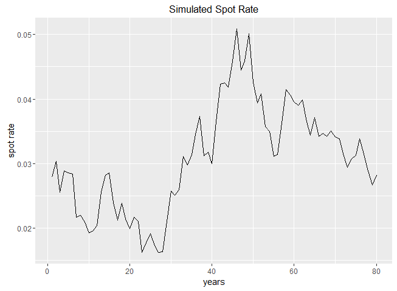
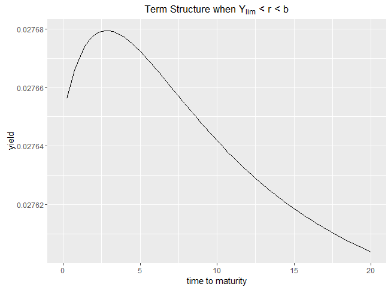

# SFM08CIRmodel
[](http://quantlet.de/index.php?p=info)

## [](http://quantlet.de/) **SFM06HAR_model** [](http://quantlet.de/d3/ia)

```yaml
Name of Quantlet: SFM08CIRmodel

Published in: Statistics of Financial Markets

Description: 'Check SFEcir on Quantlet and apply to it on the term structure modelling of interest rate.'

Keywords: 'cir, interest-rate, term structure, MLE, simulation, graphical representaion'

See also: SFEcir, SFEsimCIR, SFECIRmle, SFEcirpricing

Author: Li Mingyang, Guo Junjie, Wu Heyue, Yang Buhan

Submitted: Wed, July 20 2016 by Li Mingyang

Datafile: yield_CN1year0616.txt : 'text file for the 1-year yield to maturity of China's treasury bond.'

Input: yield_CN1year0616 : 'text file for the 1-year yield to maturity of China's treasury bond.'

Output: 'MLE estimates of the parameters of the CIR model using 1-year yield to maturity of China's treasure bond; the simulated short rate series (figure1); the term structure given different short rates (figure2, figure3 and figure4).'

```





# R code
``` r
##'SFECIRmle.R', 'SFEcirpricing.R' and 'SFEsimCIR.R' act as references for 
## this code file.

# clear history
rm(list = ls(all = TRUE))
graphics.off()

### Section 1: estimate the parameters using 1-year yield-to-maturity of
### Chinese Treasure bond. The time span of the data is 2006-07-01 to
### 2016-07-01

# install and load packages
libraries = c("neldermead", "Bessel", "ggplot2")
lapply(libraries, function(x) if (!(x %in% installed.packages())) {
    install.packages(x)
})
lapply(libraries, library, quietly = TRUE, character.only = TRUE)

# set working directory setwd('C:/...')

# load data
data = read.table("yield_CN1year0616.txt")

# Log-likelihood function of CIR model
CIRml = function(Params) {
    lData = Model$Data
    end = Model$n
    DataF = lData[1:end - 1]
    DataL = lData[2:end]
    a = Params[1]
    b = Params[2]
    sigma = Params[3]
    c = 2 * a/(sigma^2 * (1 - exp(-a * Model$delta)))
    u = c * exp(-a * Model$delta) * DataF
    v = c * DataL
    q = 2 * a * b/sigma^2 - 1
    z = 2 * sqrt(u * v)
    bf = besselI(z, q, TRUE)
    lnL = -(Model$n - 1) * log(c) - sum(-u - v + 0.5 * q * log(v/u) + log(bf) + 
        z)
    return(lnL)
}


# define and calcualte parameters

# Model
Model = NULL
Model$Data = unlist(data)/100
Model$delta = 1/252
Model$n = length(Model$Data)
end = Model$n

# least square innitial estimation
x2 = Model$Data[1:(end - 1)]
x1 = Model$Data[2:end]
xbar_1 = mean(x1)
xbar_2 = mean(x2)
x3 = x1 - xbar_1
x4 = x2 - xbar_2
y1 = sum(x3 * x4)/length(x1)
y2 = sum(x4 * x4)/length(x1)
a = 252 * log(y1/y2)
gama = exp(a/252)
b = (xbar_1 - gama * xbar_2)/(gama - 1)
y3 = x1 - b * (gama - 1) - gama * x2
y4 = (b/(2 * a)) * (gama - 1)^2 + (gama/a) * (gama - 1) * x2
sig = sum(y3^2/y4)/length(x1)
a = -a
b = -b
sigma = sqrt(sig)

# collect initial parameters
InitialParams = c(a, b, sigma)  # initial parameters for optimization

# optimize the Likelihood function
options = optimset(method = "fminsearch", MaxIter = 300, MaxFunEvals = 300, 
    Display = "iter", TolFun = c(1e-04), TolX = c(1e-04))
yhat = fminsearch(CIRml, x0 = InitialParams, options)
Results = NULL
Results$Params = neldermead.get(yhat, "xopt")
Results$Fval = -neldermead.get(yhat, "fopt")/Model$n
Results$Exitflag = yhat$exitflag
a = Results$Params[1]
b = Results$Params[2]
sigma = Results$Params[3]

# display estimating results
rbind(a, b, sigma)

print(paste("log-likelihood = ", Results$Fval))

### Section 2: simulate the spot series using the estimated parameters

n = 20  # period, unit: day
delta = 1/4  # steps per period

# simulate the series
r = rep(0, n/delta)  # set space for r(t)
r[1] = b  # the movement of spot rate starts from its mean
V = rnorm(n/delta)

for (i in 2:length(r)) {
    dr = a * (b - r[i - 1]) * delta + sigma * sqrt(abs(r[i - 1]) * delta) * 
        V[i]
    r[i] = r[i - 1] + dr
}

ggplot(data = NULL, aes(x = 1:(n/delta), y = r)) + geom_line() + ggtitle("Simulated Spot Rate") + 
    xlab("years") + ylab("spot rate")


### Section 3: plot the term structure implied by the estimated parameters

tau = seq(0, 20, by = 0.25)  # time to maturity (in years)

# define and calcualte parameters
phi = sqrt(a^2 + 2 * sigma^2)
g = 2 * phi + (a + phi) * (exp(phi * tau) - 1)
B = (2 * (exp(phi * tau) - 1))/g
A = 2 * a * b/sigma^2 * log(2 * phi * exp((a + phi) * tau/2)/g)
ylim = 2 * a * b/(phi + a)

# set spot rate
spotRate = c(0.0236, 0.02765, 0.0282)

# when spot rate is smaller than y[lim]
r1 = spotRate[1]
Bondprice = exp(A - B * r1)
termStr = -1/tau * log(Bondprice)

p1 = ggplot(data = NULL, aes(x = tau, y = termStr)) + geom_line()
p1 + xlab("time to maturity") + ylab("yield") + ggtitle(expression(paste("Term Structure when r < ", 
    Y[lim])))

# when spot is between b and y[lim]
r2 = spotRate[2]
Bondprice = exp(A - B * r2)
termStr = -1/tau * log(Bondprice)

title = expression(paste(paste("Term Structure when ", Y[lim]), " < r < b"))

p2 = ggplot(data = NULL, aes(x = tau, y = termStr)) + geom_line()
p2 + xlab("time to maturity") + ylab("yield") + ggtitle(title)

# when spot rate is bigger than b
r3 = spotRate[3]
Bondprice = exp(A - B * r3)
termStr = -1/tau * log(Bondprice)

p3 = ggplot(data = NULL, aes(x = tau, y = termStr)) + geom_line()
p3 + xlab("time to maturity") + ylab("yield") + ggtitle("Term Structure when b < r") 
```    
